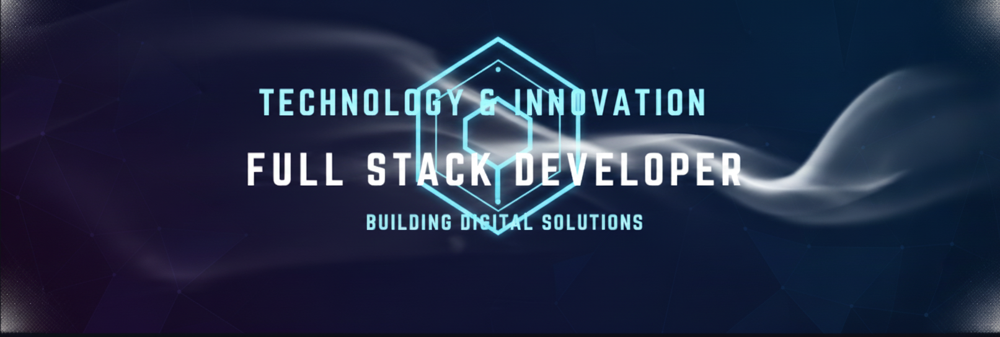

# 👋 Hi, I'm Nicolás Gutiérrez  
### Systems Engineering Student · Backend-Oriented Developer

  

---

🚀 Passionate about software development and building solid backend solutions.  
📍 Systems Engineering student at **Universidad del Valle**.

---

## 📊 GitHub Stats

  
  

---

## 🛠️ Languages & Tools

  

---

## 📌 About Me
- 🎓 Systems Engineering student at **Universidad del Valle**
- 💻 Focused on **backend development** with **Kotlin & Spring Boot**
- 🧠 Strong interest in **software architecture and databases**
- 🌐 Frontend experience with **React** and **JavaScript**
- 🤝 Open to academic, collaborative, and learning-driven projects
- 🌍 Spanish (native) | English (intermediate)

---

## 🚀 Featured Projects

  
  

---

## 📺 YouTube Channel
*Where I share some of my academic and development projects*

  

---

> *Building software with purpose, one project at a time.*

<!--
**NicolasGutierrezR/NicolasGutierrezR** is a ✨ _special_ ✨ repository because its `README.md` (this file) appears on your GitHub profile.

Here are some ideas to get you started:

- 🔭 I’m currently working on ...
- 🌱 I’m currently learning ...
- 👯 I’m looking to collaborate on ...
- 🤔 I’m looking for help with ...
- 💬 Ask me about ...
- 📫 How to reach me: ...
- 😄 Pronouns: ...
- ⚡ Fun fact: ...
-->
